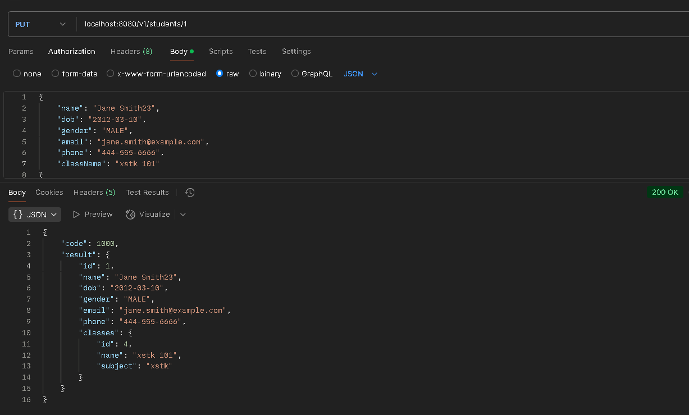

# API Sinh Viên & Lớp Học

Tài liệu này mô tả các API endpoint để quản lý thông tin Lớp học (Classes) và Sinh viên (Students).

### API Lớp Học (Classes)
Base path: /v1/classes

### 1.1 Lấy danh sách tất cả Lớp học
- Method: GET

- Endpoint: localhost:8080/v1/students
- Mô tả: Trả về danh sách tất cả các lớp học hiện có trong hệ thống.

### 1.2 Tạo Lớp học mới
- Method: POST

- Endpoint: /v1/classes

- Mô tả: Tạo một lớp học mới dựa trên thông tin được cung cấp.

### API Sinh Viên (Students)
Base path: /v1/students

### 2.1 Lấy danh sách tất cả Sinh viên
- Method: GET

- Endpoint: /v1/students

Mô tả: Trả về danh sách tất cả các sinh viên hiện có trong hệ thống.

### 2.2 Tạo Sinh viên mới
- Method: POST

- Endpoint: /v1/students

- Mô tả: Tạo một sinh viên mới và liên kết với một lớp học dựa trên className.

### 2.3 Lấy thông tin Sinh viên theo ID
   Method: GET

Endpoint: /v1/students/{id}

Mô tả: Trả về thông tin chi tiết của một sinh viên dựa vào ID.

### 2.4 Cập nhật thông tin Sinh viên
- Method: PUT

- Endpoint: /v1/students/{id}

- Mô tả: Cập nhật thông tin của một sinh viên đã tồn tại.
- Before:

- After: 

### 2.5 Xóa Sinh viên
- Method: DELETE

- Endpoint: /v1/students/{id}

Mô tả: Xóa một sinh viên khỏi hệ thống dựa vào ID.

